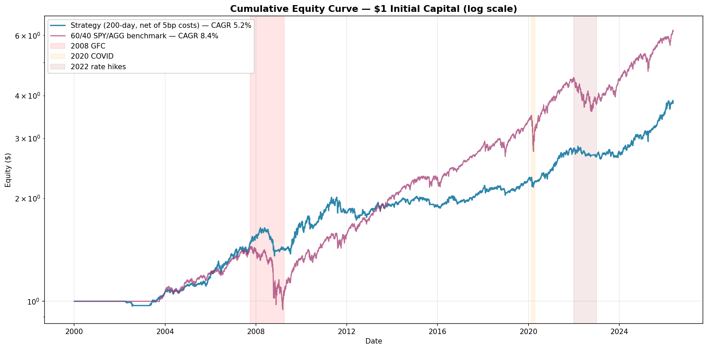
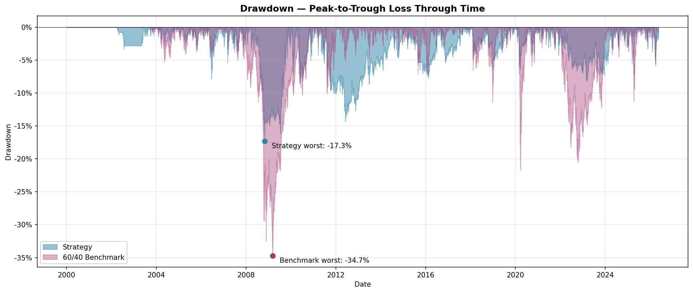
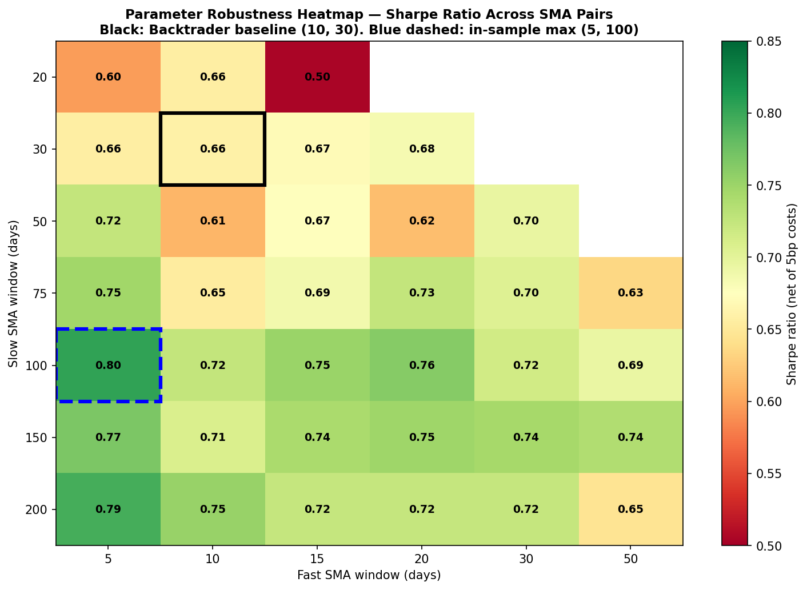

# Momentum ETF Backtest

> A trend-following backtest on a six-ETF macro universe, using Faber's 10-month filter with a BIL defensive sleeve, realistic execution costs, and a parameter robustness scan.


---

## Overview

### Inspiration

This project is built on top of the classic dual moving-average crossover example from the [Backtrader](https://github.com/mementum/backtrader) library — specifically the `sma_crossover.py` reference implementation and the [Hello Algotrading!](https://www.backtrader.com/home/helloalgotrading/) tutorial. In its original form, that strategy goes long a single stock when its 10-day SMA crosses above its 30-day SMA and flattens on the reverse cross. 

### Key Extensions

This implementation rebuilds that into something closer to a deployable macro strategy through five deliberate extensions:

**1. Diversified macro ETF universe instead of a single stock.** The original Backtrader example runs on one ticker, which exposes the strategy to idiosyncratic noise and tells you nothing about whether the underlying signal generalises. This project runs each ETF in a macro basket — SPY (US equities), EFA (international equities), AGG (US bonds), GLD (gold), DBC (commodities), VNQ (REITs) — through an independent timing model, then combines them at the portfolio level. The motivation is twofold: (i) test whether the trend-following premise generalises across asset classes rather than overfitting to one, and (ii) harvest diversification benefits that a single-asset implementation can't access. 

**2. Faber's 10-month / 200-day filter in place of the 10/30-day SMA crossover.** The original 10/30-day crossover is too short to function as a real macro signal — it generates 30+ trades per asset per year, the majority of which are noise, and has no academic provenance. Replacing it with Meb Faber's 10-month filter (Faber, 2007 — [SSRN 962461](https://papers.ssrn.com/sol3/papers.cfm?abstract_id=962461)) grounds the strategy in published research, cuts turnover by roughly an order of magnitude, and aligns rebalance frequency with the rhythm of macro data releases. Both filters are run side-by-side so the impact of this choice is explicit in the results, not hidden.

**3. Defensive sleeve in BIL (1–3 month T-bills) rather than cash.** When the trend filter is "off" for a given asset, the original example leaves capital at 0%, forgoing the risk-free rate entirely. This is a meaningful drag in non-zero-rate environments — BIL has yielded well above 5% through much of 2023–2024. Routing off-signal capital into BIL preserves the defensive function of the trend filter while capturing short-rate carry. 

**4. Explicit transaction costs and next-day-open execution.** Frictionless backtests systematically overstate live performance, and this is the single most common reason beginner strategies fail to translate from paper to reality. This implementation applies a 5bp round-trip commission via Backtrader's `cerebro.broker.setcommission(commission=0.0005)` and executes at the next day's open rather than at the close that generated the signal. 

**5. Parameter robustness heatmap, not a single tuned result.** A backtest reporting one cherry-picked parameter combination is close to worthless — it tells you that *some* configuration happened to look good in-sample, not that the strategy itself is sound. This project sweeps SMA pairs from (5, 20) up to (50, 200) and plots the resulting Sharpe-ratio surface, so the reader can see at a glance whether performance is broadly stable across the parameter space or concentrated at one fragile point. 

### Why This Matters

Taken together, these five extensions transform an instructional toy into a small but honest piece of macro trend-following research: diversified across asset classes, grounded in published literature, cost-aware, defensively realistic about idle capital, and stress-tested for parameter robustness. The original Backtrader example teaches you how to *write* a backtest; this project is about teaching the discipline of how to write a backtest you'd actually trust.

## Methodology

Each ETF in the macro universe is run through an independent trend filter; off-signal capital is routed into BIL; and positions are aggregated into an equally-weighted portfolio rebalanced monthly. Full specification:

| Parameter             | Value                                                                  |
|-----------------------|------------------------------------------------------------------------|
| **Universe**          | SPY, EFA, AGG, GLD, DBC, VNQ                                           |
| **Primary signal**    | 10-month (≈200-day) SMA — long if price > SMA, defensive otherwise     |
| **Comparison signal** | 10/30-day SMA crossover (the original Backtrader example)              |
| **Rebalancing**       | Monthly, first trading day                                             |
| **Position sizing**   | Equal weight across "on" assets                                        |
| **Defensive sleeve**  | BIL (1–3 month T-bills) when an asset's signal is off                  |
| **Execution**         | Next-day open following month-end signal                               |
| **Transaction costs** | 5bp round-trip commission, applied on entry and exit                   |
| **Robustness scan**   | SMA-pair grid from (5, 20) to (50, 200), Sharpe-ratio heatmap          |
| **Benchmark**         | 60/40 (SPY/AGG) buy-and-hold                                           |
| **Backtest period**   | 2000-01-03 to 2026-05-20 (~26.4 years)                                 |

## Results

The strategy accomplishes its primary objective — material drawdown reduction — while sacrificing risk-adjusted return relative to a passive 60/40 benchmark over the 2000–2026 sample. Net of 5bp transaction costs and using Bloomberg's USGG3M Index as the daily risk-free rate, the strategy posted a Sharpe ratio of 0.48 versus 0.61 for the benchmark, reflecting the cost of carrying a defensive overlay through extended bull markets. On metrics that prioritise downside protection — maximum drawdown and Calmar ratio — the strategy outperforms substantively: the worst peak-to-trough loss is cut from -34.7% to -17.3%, and the strategy earns 25% more return per unit of worst-case loss. The trade-off is honest: the strategy suits an investor who weights drawdown avoidance over return efficiency, and is inappropriate for one who prioritises pure Sharpe.

| Metric                          | Strategy (200-day, net) | 60/40 Benchmark |
|---------------------------------|------------------------:|----------------:|
| CAGR                            |                    5.2% |            8.4% |
| Volatility (annualised)         |                    7.1% |           11.4% |
| Sharpe Ratio                    |                    0.48 |            0.61 |
| Maximum Drawdown                |                  -17.3% |          -34.7% |
| Average Drawdown Depth          |                   -3.5% |           -4.1% |
| Calmar Ratio                    |                    0.30 |            0.24 |
| Time Underwater                 |                   83.9% |           73.1% |
| Annualised Turnover             |                  131.6% |               — |

*Backtest period: 2000-01-03 to 2026-05-20. Sharpe and Calmar use Bloomberg's USGG3M Index as the risk-free rate. Strategy returns are net of 5bp round-trip transaction costs applied per dollar of turnover at each rebalance.*



*Cumulative equity ($1 invested, log scale). The benchmark outpaces the strategy through extended bull markets (2010–2021), but the strategy materially outperforms during stress — particularly 2008, where the trend filter avoided the bulk of the GFC drawdown.*



*Peak-to-trough loss over time. The asymmetry of the 2008 GFC drawdown (strategy -17%, benchmark -35%) is the visual core of the strategy's value proposition. The benchmark spent ~3 years underwater after 2008 and another 12 months after 2022; the strategy's drawdowns are shallower but more frequent.*



*Sharpe ratio across (fast, slow) SMA pair combinations. Longer slow windows (≥100 days) systematically outperform shorter ones, and the strategy delivers Sharpe > 0.65 across the majority of reasonable parameter combinations. The (10, 30) Backtrader baseline (bold border) sits in the lower half of the parameter space — empirical support for the project's choice of Faber's 200-day filter. No single fragile parameter sweet spot.*

## Project Structure

```
momentum-etf-backtest/
├── README.md
├── LICENSE
├── .gitignore
├── requirements.txt
├── data/
│   ├── raw/              # Bloomberg risk-free rate (gitignored)
│   └── processed/        # cached ETF prices (gitignored)
├── notebooks/
│   ├── 01_data_exploration.ipynb    # initial data download and inspection
│   ├── 02_signal_research.ipynb     # signal generation and validation
│   └── 03_backtest_research.ipynb   # full backtest, metrics, charts
├── src/
│   ├── __init__.py
│   ├── data_loader.py    # ETF prices via yfinance; Bloomberg risk-free rate
│   ├── signals.py        # SMA filter (Faber) and SMA crossover signal
│   ├── backtest.py       # monthly-rebalanced backtest engine + benchmark
│   └── metrics.py        # CAGR, Sharpe, drawdowns, Calmar
├── results/
│   ├── equity_curve.png
│   ├── drawdown.png
│   └── robustness_heatmap.png
└── tests/                # placeholder for future unit tests
```

## Installation

Clone the repository and set up a Python 3.11 virtual environment:

```bash
git clone https://github.com/lopty-23/momentum-etf-backtest.git
cd momentum-etf-backtest
python3.11 -m venv .venv
source .venv/bin/activate
pip install -r requirements.txt
```

The risk-free rate analysis requires a Bloomberg USGG3M Index export at `data/raw/risk_free_rate.xlsx` (see Data Sources). All other data is downloaded automatically from Yahoo Finance on first run.

## Usage

**Run the full backtest end-to-end:**

```bash
python src/backtest.py
```

This loads cached prices (downloading from Yahoo Finance if no cache exists), loads the risk-free rate from disk, runs the strategy and benchmark, and prints the metrics table.

**Explore interactively via the notebooks:**

```bash
jupyter lab
```

Notebooks under `notebooks/` reproduce each stage of the research — data exploration, signal generation, and backtest analysis. They're numbered and intended to be read in order.

**Force a fresh data download:**

```bash
python src/data_loader.py
```

Bypasses the cache and re-downloads from Yahoo Finance. Useful when the cached prices are stale.

## Data Sources

- **ETF prices** — daily adjusted closes from Yahoo Finance via [yfinance](https://github.com/ranaroussi/yfinance). Free, automatic via the data loader, cached as Parquet on first use.
- **Risk-free rate** — Bloomberg's USGG3M Index (US Generic Government 3-Month Yield), exported manually from a Bloomberg terminal and saved to `data/raw/risk_free_rate.xlsx`. The file is excluded from version control because Bloomberg data is licensed and cannot be redistributed. Anyone reproducing this project without Bloomberg access can substitute FRED's `DTB3` series with minor changes to the loader.

## References

- Faber, M. (2007). *A Quantitative Approach to Tactical Asset Allocation.* Journal of Wealth Management. [SSRN 962461](https://papers.ssrn.com/sol3/papers.cfm?abstract_id=962461) — the 10-month / 200-day trend filter underlying this strategy's primary signal.
- Jegadeesh, N., & Titman, S. (1993). *Returns to Buying Winners and Selling Losers: Implications for Stock Market Efficiency.* Journal of Finance — the foundational paper on momentum as a risk premium.
- [mementum/backtrader](https://github.com/mementum/backtrader) — the SMA crossover example this project takes as its inspiration baseline.

## License

MIT — see [LICENSE](LICENSE).

## Author

Isaiah Hui — [github.com/lopty-23]